# Fisher Iris Dataset Analysis

---

## Table of Contents
- [Introduction](#Introduction)
- [Prerequisites](#Prerequisites)
- [Analysis](#Analysis)
  - [Data Loading and Descriptive Analysis](#data-loading-and-descriptive-analysis)
- [Missing Values Analysis](#missing-values-analysis)
- [Outliers Analysis](#outliers-analysis)
- [Correlation Analysis](#correlation-analysis)
- [Species Distribution Analysis](#species-distribution-analysis)
- [Data Visualisation](#data-visualisation)
  - [Histograms](#histograms)
  - [Scatter Plots](#scatter-plots)
  - [Box Plots](#box-plots)
  - [Violin Plots](#violin-plots)
  - [Correlation Heatmap](#note-on-commits)
- [Findings and Potential Research](#findings-and-potential-research)
- [Note on Commits](#references)
- [References](#references)

---

## Introduction
The Fisher Iris dataset, first introduced by Ronald Fisher in 1936, holds significant importance in the field of data science as a foundational dataset for machine learning and data analysis [3,4]. Fisher meticulously collected measurements of specific morphological features from three distinct species of Iris flowers: Iris setosa, Iris virginica, and Iris versicolor. With 50 samples per species, the dataset comprises a total of 150 samples. Fisher's detailed analysis of the morphological variations in sepal length, sepal width, petal length, and petal width provided valuable insights. These measurements were later utilised to develop a linear discriminant model for species classification [1]. The dataset's versatility spans various domains, making it a popular choice for classification and species recognition, exploratory data analysis, and comparisons/benchmarking tasks.

The comprehensive nature of the dataset, along with its historical significance and wide applicability, has made the Fisher Iris dataset a timeless resource in the data science community. It serves as an exemplary dataset for introducing fundamental concepts and techniques in machine learning and data analysis[5]. The dataset's balanced distribution, precise measurements, and distinct species categories contribute to its clarity and ease of interpretation. Researchers and educators continue to rely on the Fisher Iris dataset to teach and explore key concepts in classification, data exploration, and model evaluation[6].

With the Fisher Iris dataset as the foundation, this project aims to delve into the realm of data science by leveraging this well-known dataset to gain insights and showcase essential data analysis techniques. The project follows a systematic approach, beginning with data loading and descriptive analysis. Statistical methods are employed to identify missing values, detect outliers, analyse correlations, and assess the distribution of species within the dataset.

---

## Analysis

---

## Prerequisites

- **Python 3.6 or higher**

- **Pandas**
You can install it by running pip install pandas in your terminal.

- **Matplotlib**
You can install it by running pip install matplotlib in your terminal.

- **Seaborn**
You can install it by running pip install seaborn in your terminal.

- **Other**
Please ensure you have the following file saved in the same directory as the analysis script:
  - [iris.data](iris.data)[8].

### Data Loading and Descriptive Analysis

The Iris dataset is loaded into a pandas DataFrame, allowing for efficient data manipulation and analysis. Descriptive statistics are computed to provide an overview of the dataset, including the count, mean, standard deviation, and quartiles of the morphological features. These can be seen within the [summary.txt file](summary.txt).

---

## Missing Values Analysis

The dataset is checked for missing values, ensuring the integrity of subsequent analyses. Fortunately, no missing values are identified in any of the columns, allowing for a comprehensive examination of the dataset.

---

## Outliers Analysis

Outliers, defined as values that are more than 3 standard deviations away from the mean, are detected in the dataset. Among the identified outliers, sample number 15 stands out with values of 5.7 for sepal length, 4.4 for sepal width, 1.5 for petal length, and 0.4 for petal width. This outlier belongs to the Iris-setosa species.

---

## Correlation Analysis

The relationships between different variables in the dataset are explored through correlation analysis. The computed correlation matrix reveals interesting patterns. There is a strong positive correlation of 0.96 between petal length and petal width, indicating a linear relationship between these two variables. Similarly, sepal length and petal length show a positive correlation of 0.87, while sepal length and petal width exhibit a positive correlation of 0.81. These findings suggest that certain morphological features in the Iris flowers are closely related, potentially providing insights into their underlying biological characteristics.

---

## Species Distribution Analysis

The distribution of species within the dataset is analysed to understand the balanced representation of each species. The dataset contains 50 samples for each of the three species: Iris-setosa, Iris-versicolor, and Iris-virginica. This balanced distribution ensures that each species is adequately represented, reducing the risk of biases in subsequent analyses. The equal representation of species enables reliable modeling and classification of Iris flowers based on their morphological features.

---

## Data Visualisation

To gain further insights into the dataset, various visualisations have been created.

---

### Histograms

Histograms are generated to visualise the distributions of sepal length, sepal width, petal length, and petal width. The histograms provide a visual representation of the frequency of different values in each feature. From the descriptive statistics, we can observe that the measurements have varying ranges and central tendencies. Analysing the histograms allows us to gain insights into the distribution of values within each feature. For example, the sepal length histogram shows a relatively normal distribution, with the majority of the measurements centered around 5.8. On the other hand, the petal width histogram reveals a bimodal distribution, suggesting the presence of two distinct groups within the dataset. These histograms help us understand the distribution patterns and variations in the morphological features of the Iris flowers.

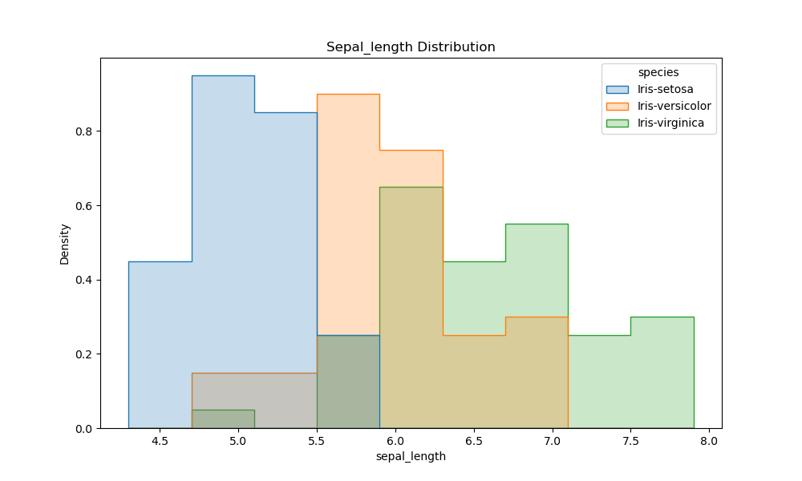
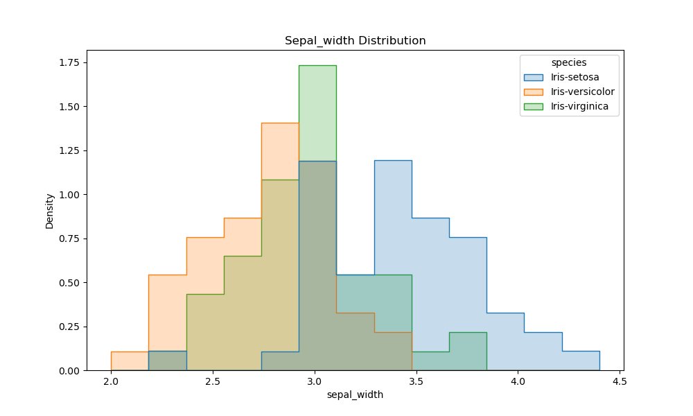
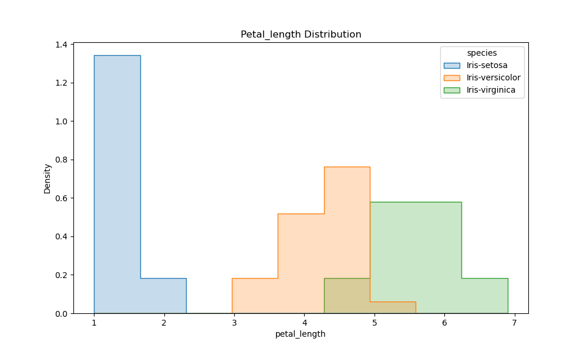
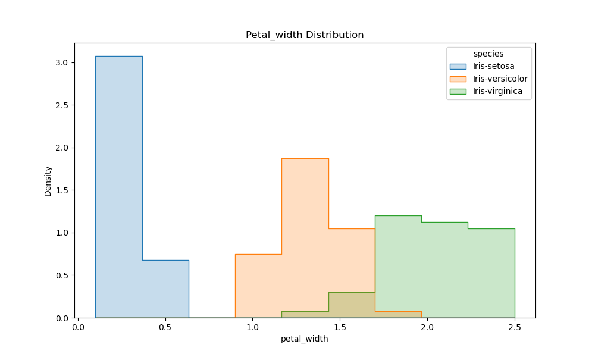

---

### Scatter Plots

Scatter plots are created to visualise the relationships between pairs of variables. The scatter plot matrix displays the relationships between sepal length and width, as well as petal length and width. By examining the correlation matrix, we can identify the presence of both positive and negative correlations between these variables. The scatter plots help us visualise these relationships and verify the observed correlations. For instance, the scatter plot of sepal length and width shows a moderate negative correlation, indicating that as sepal length increases, sepal width tends to decrease. Similarly, the scatter plot of petal length and width exhibits a strong positive correlation, suggesting that as petal length increases, petal width also tends to increase. These scatter plots provide valuable insights into the interrelationships among the morphological features of the Iris flowers.

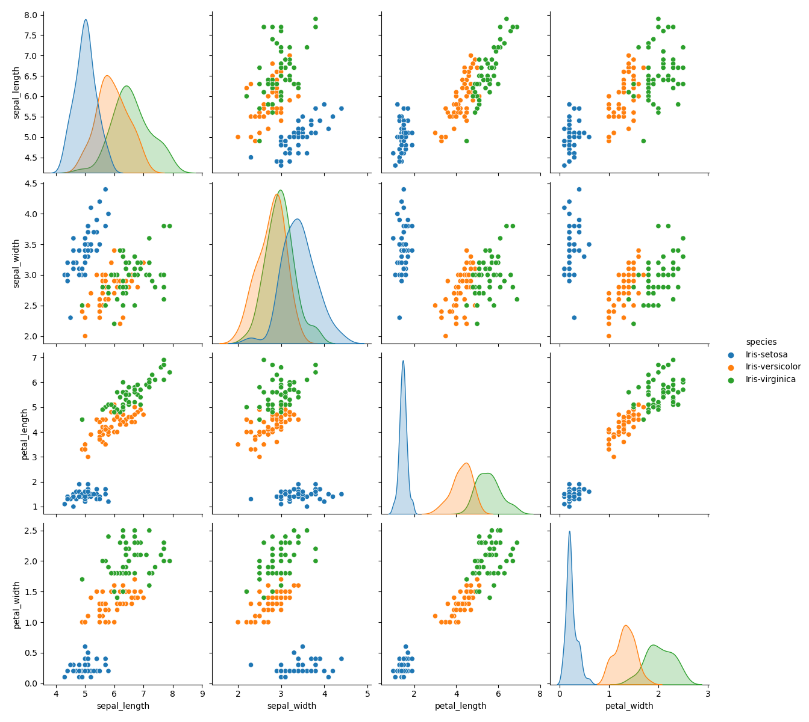

---

### Box Plots

Box plots are utilised to showcase the distributions of sepal length, sepal width, petal length, and petal width. The descriptive statistics provide insights into the central tendencies, variability, and potential outliers in the dataset. The box plots allow us to visually compare the quartiles, median, and potential outliers across the features. By analysing the box plots, we can observe the spread and skewness of each feature's distribution. For instance, the box plot of sepal length shows a relatively symmetrical distribution, with no significant outliers. On the other hand, the box plot of petal length reveals a positively skewed distribution, with a few potential outliers beyond the upper quartile. These box plots enable us to assess the variability and distribution characteristics of the morphological features in the Iris flowers.

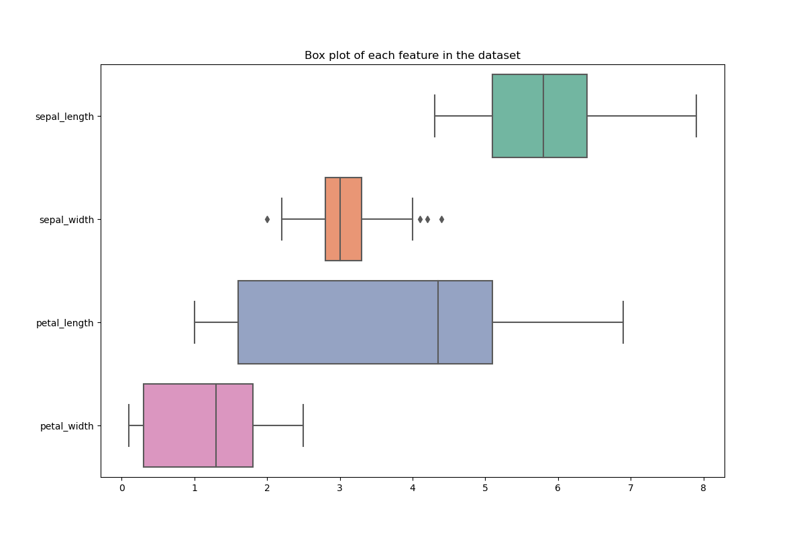

---

### Violin Plots

Violin plots are employed to visualise the distributions of sepal length, sepal width, petal length, and petal width for each species. The species counts reveal that the dataset is well-balanced, with 50 samples for each of the three species. The violin plots provide a comprehensive view of the distribution and density of the features across different species. By examining the violin plots, we can analyse the variations and differences in the morphological features among the Iris species. For example, the violin plot of sepal length illustrates that Iris-setosa tends to have a shorter sepal length compared to Iris-versicolor and Iris-virginica. Additionally, the violin plot of petal width indicates that Iris-virginica generally exhibits a wider range of petal widths compared to the other two species. These violin plots facilitate the identification of distinct patterns and variations in the morphological features of the Iris flowers within the species context.

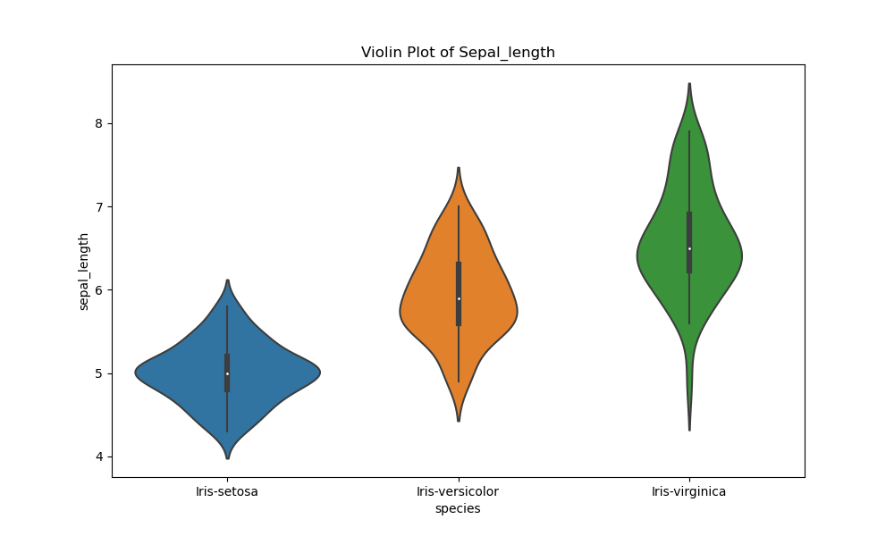
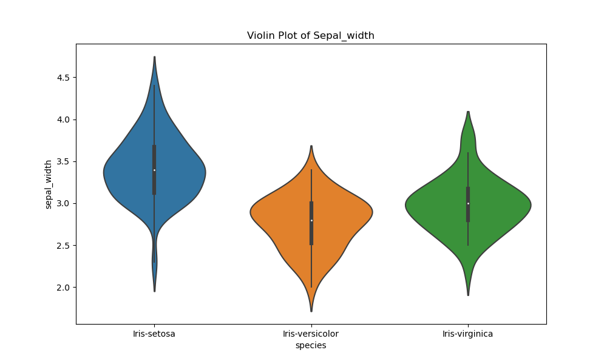
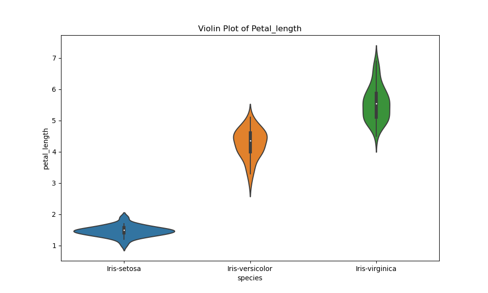
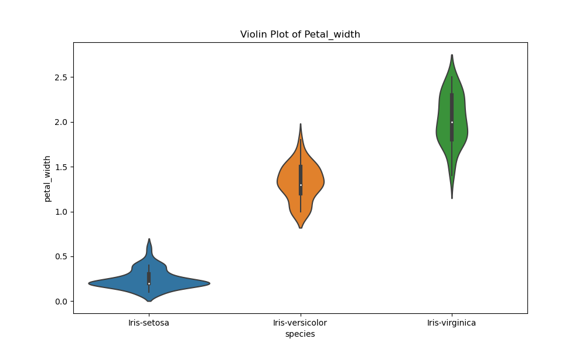

---

### Correlation Heatmap

A correlation heatmap is created to visualise the correlation matrix. The heatmap provides a colour-coded representation of the correlation values, making it easier to identify strong positive or negative correlations between variables.

The correlation heatmap reveals the interdependencies and associations between the variables. By observing the colour intensity and patterns in the heatmap, we can identify the strength and direction of the correlations. Darker shades indicate stronger correlations, while lighter shades represent weaker correlations.

Upon analysing the heatmap, we observe several interesting correlations. Notably, there is a strong positive correlation between petal length and petal width, indicated by the dark red colour. This suggests that as the length of the petal increases, the width of the petal also tends to increase. Similarly, there are positive correlations between sepal length and petal length, as well as sepal length and petal width. These findings align with our previous observations from the scatter plots, further confirming the relationships between these variables. There are negative correlations between sepal width and petal length, as well as sepal width and petal width. These negative correlations indicate that as the sepal width increases, the petal length and petal width tend to decrease. These relationships provide insights into the morphological characteristics of the Iris flowers and contribute to our understanding of their biological attributes.

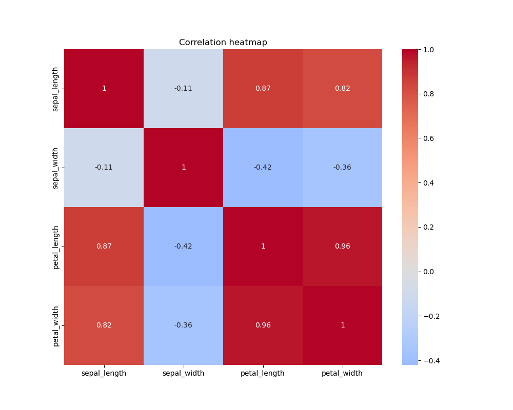

---

## Findings and Potential Research

The analysis of the Fisher Iris dataset has revealed several interesting insights:

- The dataset consists of three distinct species of Iris flowers: Iris setosa, Iris virginica, and Iris versicolor.
- The morphological features, including sepal length, sepal width, petal length, and petal width, exhibit variations among the different species.
- Correlation analysis indicates strong positive correlations between petal length and petal width, as well as sepal length and petal length.
- The dataset is well-balanced, with 50 samples for each species, allowing for reliable modeling and classification tasks.

I note lots of future research has and is taking place with this dataset. But from a personal perspective, I would aim to develop my skills to enable me to explore: 

- Applying machine learning algorithms for species classification and prediction.
- Exploring additional statistical analyses to uncover more insights into the dataset.
- Investigating the relationship between the morphological features and other external factors, such as environmental conditions, to gain a deeper understanding of the factors influencing the Iris flowers.

---

## Note on Commits

The commit history in this repository may appear different from the expected norm due to the consolidation of work and uploading all the files at once. This approach was chosen to streamline the process and ensure the completeness of the project. Rest assured that future repositories will adhere to more frequent and detailed commit messages to better track changes and progress.

Additionally, please note that during the development of this project, there was a temporary interruption due to personal commitments, such as my wedding and mini-moon after the wedding. The project was resumed promptly after the event, and the analysis and documentation were completed with utmost professionalism.

I appreciate your understanding and assure you of my commitment to maintaining a high level of professionalism in future projects.

---

## References

1. Fisher, R. A. (1936). The Use of Multiple Measurements in Taxonomic Problems. Annals of Eugenics, 7(2), 179-188.
2. Fisher's Iris dataset. (n.d.). In UCI Machine Learning Repository. Retrieved from https://archive.ics.uci.edu/ml/datasets/iris
3. Wikipedia entry: Iris flower data set. https://en.wikipedia.org/wiki/Iris_flower_data_set
4. Singer, J. D., & Willett, J. B. (1990). Improving the teaching of applied statistics: Putting the data back into data analysis. The American Statistician, 44(3), 223-230.
5. Hastie, T., Tibshirani, R., & Friedman, J. (2009). The Elements of Statistical Learning: Data Mining, Inference, and Prediction (2nd ed.). Springer.
6. Scikit-learn. (n.d.). Iris Species Dataset. Retrieved from https://scikit-learn.org/stable/datasets/toy_dataset.html#iris-dataset
7. ChatGPT: OpenAI. (2021). GPT-3.5. https://openai.com/blog/gpt-3-5/
8. Dua, D., & Graff, C. (2019). UCI Machine Learning Repository. Irvine, CA: University of California, School of Information and Computer Science. Retrieved from http://archive.ics.uci.edu/ml/datasets/Iris

